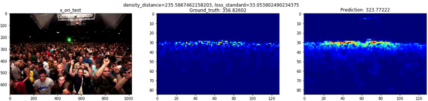

# CSRNet_in_Keras
> It is an unofficial Keras version implementation of CSRNet for crowd counting in  of a CVPR 2018 paper: [CSRNet: Dilated Convolutional Neural Networks for Understanding the Highly Congested Scenes](https://www.researchgate.net/publication/323444534_CSRNet_Dilated_Convolutional_Neural_Networks_for_Understanding_the_Highly_Congested_Scenes) by _Yuhong Li, Xiaofan Zhang, and Deming Chen_

### Run:

0. Download dataset: the data can be downloaded on [dropbox](<https://www.dropbox.com/s/fipgjqxl7uj8hd5/ShanghaiTech.zip?dl=0>) or [Baidu Disk](<http://pan.baidu.com/s/1nuAYslz>).

1. Data generation: run the`generate_datasets.ipynb ` to generate formatted data in the `data/`.

2. Run the `main.ipynb` to train the model.

### Training:

+ Use Adam(lr=1e-6) as the optimizer.
+ Batch_size = 1.

### Experiments on ShanghaiTech dataset:

+ On dataset A(around 200 epochs):

  