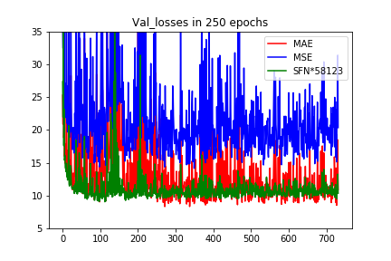
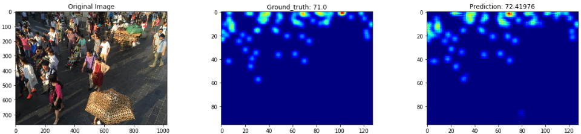

# CSRNet-Keras
> Unofficial implementation of CSRNet for crowd counting in Keras.

---

## Paper:

+ Original_paper: [CSRNet: Dilated Convolutional Neural Networks for Understanding the Highly Congested Scenes](https://www.researchgate.net/publication/323444534_CSRNet_Dilated_Convolutional_Neural_Networks_for_Understanding_the_Highly_Congested_Scenes).

### Results now:

| Dataset | MAE    | RMSE    | Sum of Frobenius Norm | MAPE  | PSNR  | SSIM |
| :-----: | :----: | :-----: | :-------------------: | :---: | :---: | :--: |
|   SHB   | 8.31   | 14.36   |        5.26e-2        | 6.63% | 29.31 | 0.93 |
|   SHB   | 71.238 | 114.748 |        8.65e-1        | 17.3% | 21.46 | 0.61 |
> Weights can be downloaded in the [release]().

### Dataset:

- **ShanghaiTech dataset**: [dropbox](<https://www.dropbox.com/s/fipgjqxl7uj8hd5/ShanghaiTech.zip?dl=0>) or [Baidu Disk](<http://pan.baidu.com/s/1nuAYslz>).

### Training Parameters:

1. *Loss* = MSE;

2. *Optimizer* = Adam(lr=1e-5);

3. *Batch size*: 1;

4. *Data augmentation*: Flip horizontally online randomly;

7. *Weights*: Got best weights of SHB in epoch135(250 epochs in total), and here is the loss records:

   

8. *Prediction example*:

   

### Run:

1. Download dataset;
2. Data generation: run the`generate_datasets.ipynb `.
3. Run the `main.ipynb` to train, test, analyze and evaluate the image quality.
