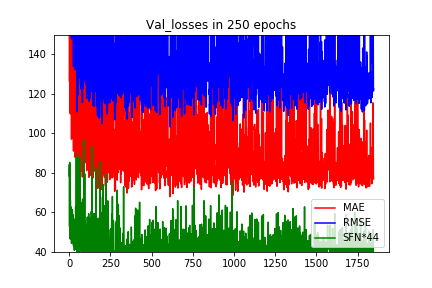

# CSRNet-Keras
> An unofficial implementation of CSRNet for crowd counting in Keras-Tensorflow.

---

## Paper:

+ Original_paper: [CSRNet: Dilated Convolutional Neural Networks for Understanding the Highly Congested Scenes](https://www.researchgate.net/publication/323444534_CSRNet_Dilated_Convolutional_Neural_Networks_for_Understanding_the_Highly_Congested_Scenes).

### Results now:

| Dataset |  MAE  |  RMSE  | Sum of Frobenius Norm |  MAPE  | PSNR  | SSIM |
| :-----: | :---: | :----: | :-------------------: | :----: | :---: | :--: |
|   SHB   | 8.31  | 14.36  |        5.26e-2        | 6.63%  | 29.31 | 0.93 |
|   SHA   | 67.98 | 103.24 |        8.38e-1        | 17.29% | 21.51 | 0.60 |
> Weights can be downloaded in the [release](https://github.com/ZhengPeng7/CSRNet-Keras/releases/tag/v1.0).

### Dataset:

- **ShanghaiTech dataset**: [dropbox](<https://www.dropbox.com/s/fipgjqxl7uj8hd5/ShanghaiTech.zip?dl=0>) or [Baidu Disk](<http://pan.baidu.com/s/1nuAYslz>).

### Training Parameters:

1. *Loss* = MSE;

2. *Optimizer* = Adam(lr=1e-5);

3. *Batch size*: 1;

4. *Data augmentation*: Flip horizontally online randomly;

5. *Weights*: Got best weights of SHB in epoch 135, the best one of SHA in epoch 127, and here is the loss records:

   + SHA:

   

   + SHB:

   

   

6. *Prediction example*:

   

   

### Run:

1. Download dataset;
2. Data generation: run the`generate_datasets.ipynb `.
3. Run the `main.ipynb` to train, test, analyze and evaluate the image quality.
